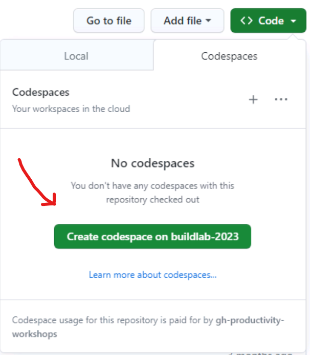

## Explore GitHub Codespaces

Cloud computing has exploded in the past few decades. But the cloud can be used for more than just running production workloads - it can host your development environments as well!

[GitHub Codespaces](https://github.com/features/codespaces) allow you to code from almost anywhere in the world, giving you Visual Studio Code backed by high performance VMs that start in seconds and can be customized to perfectly suit the code you're working on.

The advantages of using Codespaces over local development are many. You can standardize on a set of dependencies for a project, onboard a new developer in seconds rather than days, and spin up and tear down context-aware Codespaces at a moment's notice.

>[!knowledge] 🤯 Fun Fact: GitHub itself uses Codespaces to develop GitHub! New engineers can go from zero to ready to code in about 10 seconds. And that's on an 11GB codebase!

Your first task is to launch a GitHub Codespace, customize it, and then launch PetSpotR within it.

### 1.1 Launch a GitHub Codespace

You'll begin by launching a new GitHub Codespace. This will give you a pre-configured environment with all the tools you need to run PetSpotR.

1. Open Edge in the lab VM and navigate to the PetSpotR GitHub repository (first bookmark) and make sure you are on the 'buildlab-2023' branch:
    ```
    https://github.com/gh-productivity-workshops/PetSpotR/tree/buildlab-2023
    ```
2. Sign into GitHub with your GitHub account
    - Make sure you have provided your GitHub username to the lab assistant so you have access to Codespaces. If you haven't, please do so now.
3. Click the `<> Code` button and select the `Codespaces` tab
   
4. Click the `Create codespace on buildlab-2023` button to launch a new Codespace on the `buildlab-2023` branch

You should now drop directly into a Codespace with the PetSpotR repository cloned and ready to go.

### 1.2 Explore the Codespace

1. In the Codespace terminal, run 'ls -a' to list the files and directories in the repository:
    
    ```bash
    $ ls -a
    ```

    You should see the following files and directories:

    ```
    .
    ..
    .devcontainer
    docs
    .git
    .github
    .gitignore
    iac
    img
    LICENSE
    README.md
    src
    tests
    .vscode
    ```

    Important directories to note are:

    - `.devcontainer` contains the configuration for this Codespace environment.
    - `docs` contains the documentation for the application, including this lab guide.
    - `iac`  contains the Bicep infrastructure as code (IaC) for the application. We'll revisit this directory later in the lab.
    - `src`  contains the source code for the application's backend and frontend services.
    - `.vscode` contains the configuration for both the Codespace and Visual Studio Code.

2. Your Codespace also can run Docker containers inside of it! Run 'docker ps' to list the running containers:
    
    ```bash
    docker ps
    ```

    You should see the following containers:

    ```
    CONTAINER ID   IMAGE                COMMAND                 ...
    57e30aa3124c   openzipkin/zipkin    "start-zipkin"          ...
    570e831d9299   daprio/dapr:1.10.5   "./placement"           ...
    ff778032cc52   redis:6              "docker-entrypoint.s…"  ...
    ```

    These are the default Dapr containers for Zipkin, Dapr placement service, running in the Codespace. They were created by the `dapr init` command that was run when the Codespace was created. They will be used when you run PetSpotR in the Codespace later on.

    >[!knowledge] Wait, I thought a Codespaces was already a container, how can it run Docker containers within the container? Docker support in Codespaces is enabled through the docker-in-docker feature. There are additional options for docker-outside-of-docker. Visit containers.dev/features to learn more.

3. Let's take a look at how to customize your Codespace. Open `.devcontainer/devcontainer.json` to see the Codespace definition:

    ```bash
    code .devcontainer/devcontainer.json
    ```

    You'll notice some important properties:
    
    - `image` - The Docker image used to create the Codespace
    - `onCreateCommand` - The command to run when the Codespace is created, which can be used to install dependencies or other setup tasks
    - `features` - A list of [features](https://github.com/devcontainers/features) to install in the Codespace, such as Python support, the Azure CLI, and Docker-in-Docker support
    - `customizations.vscode.extensions` - A list of Visual Studio Code extensions to install in the Codespace

### 1.3 Customize your Codespace

Now that you're up and running with your Codespace, let's get ready to use GitHub Copilot!

Let's add the GitHub Copilot extension, but let's add it to the devcontainer rather than just install it.

1. Open the "Extensions" () pane
2. Search for "Copilot" and select the GitHub Copilot extension

3. Click the green "Install in Codespaces" button to install the Copilot extension. You now have Copilot installed and can verify by the Copilot logo in the bottom-right corner (_if you don't see the icon refresh your page to force your extensions to reload_):

   
4. You can also click the gear and select (Add to devcontainer.json) to add this extension to the definition of the Codespace. This allows all future Codespaces to get this extension on creation. (We won't be committing/pushing this now, but on your own branch you could).
5. Done! You've successfully opened and customized your Codespace.

Check out the next section (bottom right corner of the page) to learn how to debug and run PetSpotR locally.
