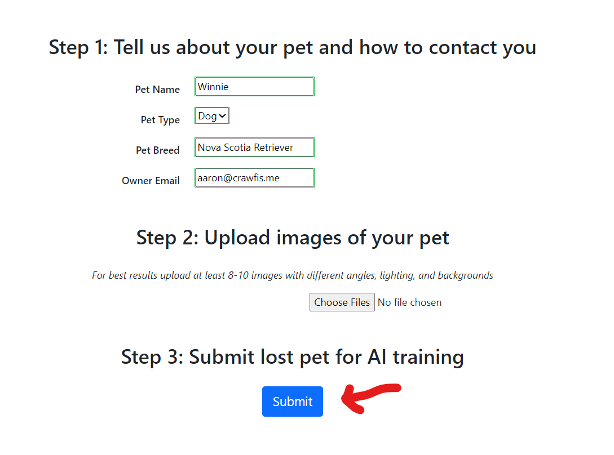

## Use GitHub Copilot to add Dapr to the frontend

2023 saw an explosion of artificially intelligent (AI) tools into the mainstream, promising increased productivity and removing busywork. [GitHub Copilot](https://github.com/features/copilot) is your AI pair programmer and was one of the first commercially-available tools based on Large Language Models (LLMs). First released as a technical preview in June 2021, it was made generally available to individuals one year later in June 2022.

GitHub Copilot can suggest code and entire functions to help you code faster, focus on business logic over boilerplate, and be a happier and more productive developer!

Your next task is to use GitHub Copilot to add Dapr to the PetSpotR application.

>[!alert] ⚠️ GitHub Copilot is non-deterministic! It syntheses code just for you, so you will likely see different suggestions than the person next to you! We'll talk about how to get the best out of Copilot a little later.

### 3.1 Add Dapr to the frontend

1. Open `src\frontend\PetSpotR\Data\PetModel.cs` to open the Pet model:
    
    ```bash
    code ./src/frontend/PetSpotR/Data/PetModel.cs
    ```
2. Within `SavePetStateAsync` replace the current Console.WriteLine() and comment with a comment describing what you want to do:
    
    ```csharp
    public async Task SavePetStateAsync(DaprClient daprClient)
    {
        // Save state to "pets" Dapr state store, using the supplied Dapr client
    }
    ```
3. You'll now see GitHub Copilot suggest a new method to add to the Pet model. Hit `Tab` to accept the suggestion and add the method to the Pet model.

    

    > 🤔 _We refer to this suggestion mechanism as "ghost text". You can hit Tab to accept a suggestion, or simply ignore it and keep typing._

    You should see something like this (_your results might slightly differ as Copilot can be non-deterministic_):

    ```csharp
    public async Task SavePetStateAsync(DaprClient daprClient)
    {
        // Save state to "pets" Dapr state store, using the supplied Dapr client
        await daprClient.SaveStateAsync("pets", ID, this);
    }
    ```
4. You'll notice that we're not using a try/catch block for this remote Dapr call. To add one, delete the previous line you just added, type `try` and hit `Tab` to accept the suggestion. You'll now see a new try/catch block added to the method:

    

5. Repeat the above process to add update the `PublishLostPetAsync` method to publish the lost pet to the "lostPet" topic. Try the following comment:

    ```csharp
    // Publish a message to the "lostPet" Dapr pub/sub topic on the "pubsub" broker
    ```

    You should end up with the following method:

    ```csharp
    public async Task PublishLostPetAsync(DaprClient daprClient)
    {
        // Publish a message to the lostPet Dapr pub/sub topic on the pubsub broker
        try 
        {
            await daprClient.PublishEventAsync("pubsub", "lostPet", this);
        }
        catch (Exception e)
        {
            Console.WriteLine("Error publishing lost pet: " + e.Message);
        }
    }
    ```

### 3.2 Test out your changes

Now that you've made changes within your Codespace, let's debug the application again, this time using Dapr to save the pet's state and publishing a message to the backend.

1. Select the `Run and Debug` () tab in the left-hand pane of the Codespace.
2. Make sure the launch configuration is set to `✅ Debug with Dapr`
3. Click the `Start Debugging` button (▶️) to launch PetSpotR locally
4. Visit the `Lost` and `Found` pages to see the application's interface. You'll see that the form now works, and you can add lost and found pets to the application.
5. Report a lost pet using the form. Your desktop has some test images:
    

### 3.3 Visualize the results

In the previous step you persisted your pet's state. This was done through the local Dapr state store that's running as a Docker container in your Codespace (this is what you saw when you ran `docker ps`). Let's take a look at the pet data you just saved:

1. In your Codespace open the Redis extension (), and add the default Redis connection, accepting the default values:
   
2. In `db0` you should now see your saved state, and in `lostPet` you should see your lost pet messages:
   

Done! You've now just added Dapr into your application using Copilot.

_The instructor will now demonstrate how to use Bicep to model your infrastructure. You can wait to follow along, or you can continue with the exercises below._
