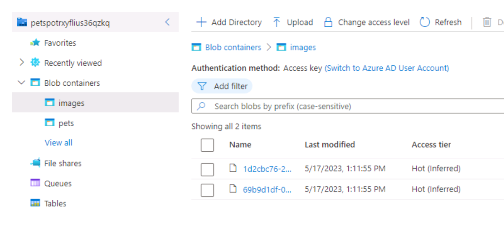

## Use Bicep to model your infrastructure as code

We're now ready to deploy PetSpotR to Azure. You'll use Bicep to model your infrastructure as code. Bicep is a domain-specific language (DSL) for describing and deploying Azure resources declaratively. You'll use Bicep to deploy PetSpotR to Azure.

### 4.1 Create a Bicep template for your images storage account

1. Open `iac/infra.bicep` to open the Bicep template for your infrastructure:

    ```bash
    code ./iac/infra.bicep
    ```

    Notice that the storage module has an error, because the file `storage.bicep` is empty. Let's fix that!

2. Open the empty file `storage.bicep`, which will contain the definition of your storage account:

    ```bash
    code ./iac/infra/storage.bicep
    ```

3. Using Copilot, let's generate the parameters we need. Let's use comments as a starting point:

    ```bicep
    // Parameter for the location of the storage account

    // Parameter for the name of the storage account
    ```

    You may need to provide some extra hints, such as typing `param` to get Copilot to render the correct format.

    Copilot should generate the following parameters:

    ```bicep
    // Parameter for the location of the storage account
    param location string = resourceGroup().location

    // Parameter for the name of the storage account
    param storageAccountName string
    ```

4. We now need a new resource, `storageAccount`, which will be an Azure storage account. Use Copilot with comments for suggestions to generate the resource:

    ```bicep
    // Storage account for storing images
    ```

    Copliot should generate the following resource:

    ```bicep
    // Storage account for storing images
    resource storageAccount 'Microsoft.Storage/storageAccounts@2019-06-01' = {
      name: storageAccountName
      location: location
      kind: 'StorageV2'
      sku: {
        name: 'Standard_LRS'
      }
    }
    ```

5. To make the storage account available to other resources, you'll need to pass back the storage account's name. Use another comment to have Copilot generate the output:

    ```bicep
    // Output for the storage account name
    ```

    Copilot should generate something similar to the following output:

    ```bicep
    // Output for the storage account name
    output storageAccountName string = storageAccount.name
    ```

### 4.2 Deploy your infrastructure to Azure

You're now ready to deploy your application to Azure. You'll use the Azure CLI to deploy your infrastructure:

1. Run `az login --use-device-code` to log in to Azure. You'll need to use a device code because you're running in a Codespace.
   - +++@lab.CloudPortalCredential(User1).Username+++
   - +++@lab.CloudPortalCredential(User1).Password+++

    _You can also click on the Resources tab to view these credentials._

2. Deploy your iBicep file using `az deployment create`

    ```bash
    az deployment create --location westus2 --template-file ./iac/infra.bicep
    ```
3. You can visit +++https://portal.azure.com+++ to see the resources being deployed under your new `build-lab` resource group.
    

### 4.3 Configure your cluster

Now that you've deployed your infrastructure, you're ready to configure your cluster. You'll use the Dapr CLI to install Dapr.

1. Run `az aks get-credentials` to get the credentials for your AKS cluster:

    ```bash
    az aks get-credentials --resource-group build-lab --name petspotr
    ```

2. Run `dapr init -k` to install Dapr into your Kubernetes cluster:

    ```bash
    dapr init -k
    ```

Done! You now have Dapr installed on your AKS cluster.

### 4.4 Deploy Dapr cloud components

Now that you've installed Dapr on your cluster, you're ready to deploy the Dapr cloud components. When running PetSpotR locally, you used the Redis state store and pub/sub components. In Azure, you'll use an Azure Storage Account and Azure Service Bus.

1. Open `iac/dapr/azure/statestore.yaml` to open the YAML template for your Dapr state store component:

     ```bash
     code ./iac/dapr/azure/statestore.yaml
     ```

     You can also view images.yaml and pubsub.yaml.

2. Deploy these components using `kubectl apply`:

    ```bash
    kubectl apply -f ./iac/dapr/azure
    ```

3. Done! You've now added Dapr components to your cluster.

### 4.5 Deploy your application to Azure

You're now ready to deploy your application to Azure. You'll use the Azure CLI to deploy your application:

1. Open `iac/app.bicep` to open the Bicep template for your application:

    ```bash
    code ./iac/app.bicep
    ```

    Notice the use of modules for the frontend, backend, ingress, and secrets.

2. Open `iac/app/frontend.bicep` to see a set of Kubernetes resources. That's right, Bicep does Kubernetes!

    ```bash
    code ./iac/app/frontend.bicep
    ```

3. Deploy your application using `az deployment create`

    ```bash
    az deployment group create --resource-group "build-lab" --template-file ./iac/app.bicep
    ```

### 4.6 Access the PetSpotR application

Now that you've deployed your infrastructure and application you're ready to access the PetSpotR application!

1. Get the hostname of your HTTP ingress:

    ```bash
    kubectl get ingress
    ```

1. Try out the application by reporting a lost pet
1. Open the storage account in the Azure portal and navigate to the `images` container. You should see the image you uploaded:
   
1. Open the 'pets' container in the storage account and you should see the pet you reported:
   

Done! You've now deployed PetSpotR to Azure using Bicep and used cloud Dapr bindings to connect to Azure services.
